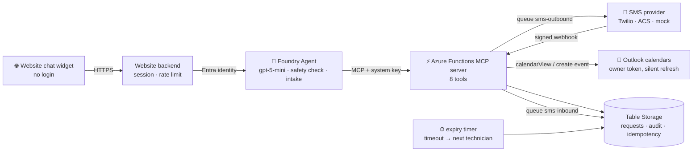
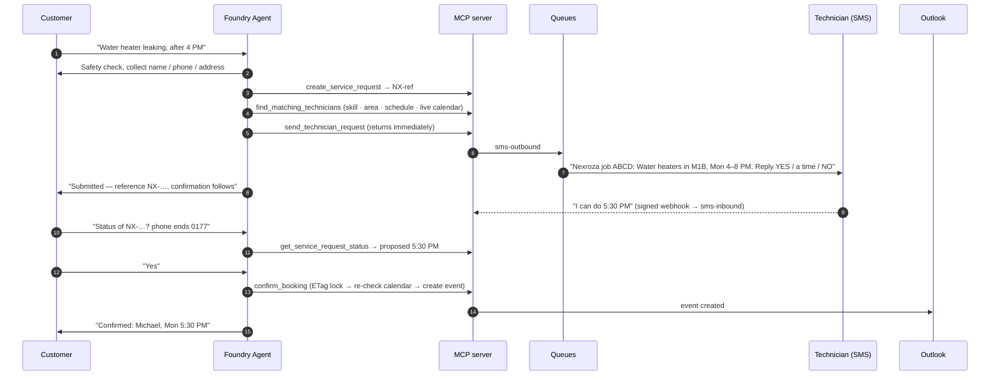
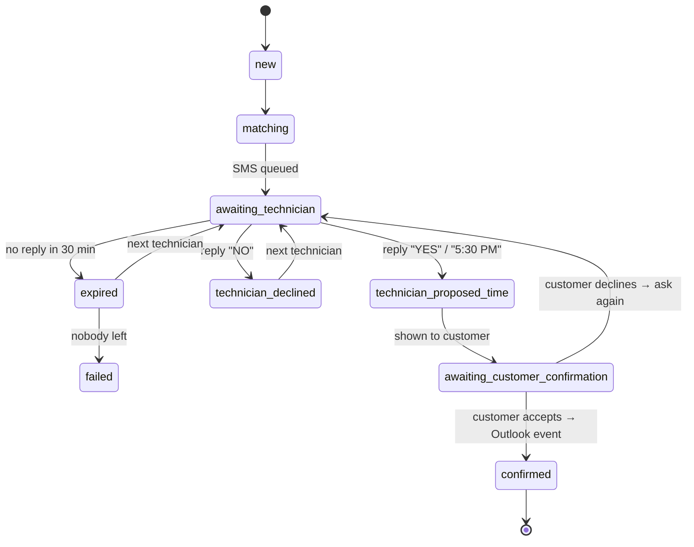

<div align="center">



# Full AI Customer Service Handling

**An AI receptionist for service businesses that actually books the job.**
Website chat → safety check → live technician calendars → SMS to the technician → customer confirms → appointment lands in Outlook. Fully asynchronous, fully audited, zero customer sign-in.

[](https://learn.microsoft.com/azure/azure-functions/)
[](https://learn.microsoft.com/azure/ai-foundry/)
[](#the-mcp-tools)
[](#quick-start)
[](#testing)
[](https://github.com/Ray-Khosravi/full-ai-customer-service-handling/commits/main)
[](LICENSE.md)

</div>

---

## Why this exists

Every plumber, electrician and HVAC company loses jobs the same way: the phone rings while the technician is under a sink, the website form goes to an inbox nobody checks, and the customer books the next company that answers. This project turns a website chat widget into a **24/7 receptionist that dispatches real technicians** — reading their real calendars, texting them, and confirming with the customer — while the business owner does nothing but keep their Outlook calendar up to date.

Built for **Nexroza Plumbing (Toronto)**; designed so any field-service business can fork it.

## What a customer sees (real transcript from the end-to-end test)

> **Customer:** My gas water heater is leaking in Scarborough. I need someone today after 4 PM.
> **Assistant:** Thanks — a few safety questions first. 1) Do you smell gas or hear hissing near the water heater? If yes, leave the building, don't operate switches, call your gas utility emergency line or 911 from outside… 2) Any active flooding or water near electrical outlets? …
> **Customer:** No gas smell, no flooding — just dripping from the bottom of the tank. Tomorrow after 4 PM works.
> **Customer:** My name is Sam Tester, phone 416‑555‑0177, 25 Test Road, Scarborough, M1B 2K3. Yes, text me updates.
> **Assistant:** Request submitted. A technician (Michael) is being contacted by SMS to confirm an appointment on 2026‑09‑14 between 4:00 PM and 8:00 PM. **Tracking reference: NX‑QWL6A99EPNOR.** Confirmation will follow once he replies.
>
> *(Michael texts back "I can do 5:30 PM". Later…)*
>
> **Customer:** Any update on NX‑QWL6A99EPNOR? My phone ends in 0000.
> **Assistant:** Sorry — I couldn't find a request with that reference + phone.
> **Customer:** Sorry, my number is 416‑555‑0177.
> **Assistant:** Michael proposed **Monday September 14 at 5:30 PM**. Do you confirm?
> **Customer:** Yes, 5:30 works.
> **Assistant:** Done — your booking is confirmed. Technician: Michael · Monday September 14 at 5:30 PM.

Behind that last line an Outlook event was created in Michael's calendar and the request moved to `confirmed` — and only then did the assistant say "confirmed".

## How it works







## The MCP tools

| Tool | What it does |
|---|---|
| `check_availability` | weekly schedule ∧ live Outlook status per technician for a date/window |
| `get_technician_work_status` | `WORKING / OFF / SICK / VACATION / ON_CALL` from calendar events |
| `create_service_request` | validates input, returns a high‑entropy tracking reference (`NX‑…`) |
| `find_matching_technicians` | skill · active · service area (postal FSA) · schedule · calendar · pending load · on‑call fallback |
| `send_technician_request` | queues the SMS and **returns at once** — the agent never waits |
| `get_service_request_status` | reference + callback phone → customer‑safe status and any proposed time |
| `confirm_booking` | ETag‑locked, calendar re‑checked, Outlook event created, then — and only then — `confirmed` |
| `list_technician_calendars` | technicians, skills, calendar presence |

## What makes it production‑grade

- **Asynchronous by design** — no HTTP request or agent run ever waits for a human. Storage queues, signed webhooks, 5‑minute expiry sweeps, automatic fallback to the next technician, poison‑queue handling.
- **Never invents availability** — the agent must call a tool before any availability claim; a tool failure is reported honestly ("live availability couldn't be checked"), never guessed.
- **Says "confirmed" only after Outlook says so** — the booking is created with an ETag lock (4 concurrent confirmations → exactly one event) and re‑checks the calendar first.
- **Security first** — MCP endpoint behind a system key held in a Foundry connection (never in the browser), customers never sign in to Microsoft, tracking references are ~72‑bit random and stored hashed, second factor = callback phone, internal IDs never leave the server, provider webhooks validated (`X‑Twilio‑Signature` / HMAC), phone numbers and message IDs redacted in logs, no PII in alerts or SMS bodies, prompt‑injection hardened (plus Azure prompt shields).
- **Owner authorizes once** — a PKCE public‑client flow (no client secret) stores a refresh token in a private blob; the server refreshes it silently. A 30‑minute heartbeat and Azure Monitor alerts tell you before the customer does.
- **Observable** — status history per request, Application Insights markers (`SERVICE_REQUEST_FAILED`, `SMS_DELIVERY_FAILURE`, `POISON_MESSAGE`, `BOOKING_FAILED`, …), 4 alert rules for ≈ US$2/month.
- **Cheap to run** — Flex Consumption Functions + Table Storage + queues ≈ a few dollars a month; the model is pay‑per‑token.

## Quick start

```bash
git clone https://github.com/Ray-Khosravi/full-ai-customer-service-handling
cd full-ai-customer-service-handling
cp deploy.env.example deploy.env        # your resource names (git-ignored)

# 1) infrastructure + function app (Azure Developer CLI)
cd src/FunctionsMcpTool && azd up

# 2) one-time Outlook authorization by the business owner (opens a private browser window)
python ../../tools/authorize_outlook.py

# 3) Foundry: store the MCP key in a project connection and publish the agent
python ../../foundry/create_connection.py
az rest --method post --resource https://ai.azure.com \
  --url "https://<foundry-account>.services.ai.azure.com/api/projects/<project>/agents/Plumbing-Service-Coordinator/versions?api-version=2025-11-15-preview" \
  --headers Content-Type=application/json --body @../../foundry/agent-version.json

# 4) talk to it
python ../../web/test_client/server.py     # http://localhost:8787
```

Full runbook — calendar naming rules, database schema, SMS providers (Twilio / Azure Communication Services / mock), monitoring, troubleshooting, costs: **[docs/OPERATIONS.md](docs/OPERATIONS.md)**. Website integration contract: **[web/INTEGRATION.md](web/INTEGRATION.md)**.

## Testing

| Layer | Command | Covers |
|---|---|---|
| Unit (43) | `pytest src/FunctionsMcpTool/tests -q` | validation, state machine, matching, OFF/SICK/VACATION exclusion, ON_CALL fallback, Toronto DST, duplicate webhooks, decline / timeout / fallback, confirmation, Graph failure, concurrency, secure lookup, injection, provider signatures |
| Deployed workflow | `python foundry/test_mcp_workflow.py` | MCP → queues → signed webhook → status → Outlook event |
| Full conversation | `python foundry/test_e2e_conversation.py` | the transcript above, through the real agent |
| Live SMS (hybrid) | `python foundry/test_twilio_hybrid.py` | one real Twilio SMS + real delivery callback; simulated carrier step; 403 on bad signature; idempotent duplicates |

## Repository layout

```
src/FunctionsMcpTool/   Azure Functions app — function_app.py (triggers) + nexroza/ (workflow, store, graph, sms, matching, replies)
foundry/                agent instructions & version, connection script, operator scripts, end-to-end tests
tools/                  one-time Outlook owner authorization
web/                    website integration contract + standalone chat widget/test backend
infra/                  Bicep for azd (Function App, storage, identity, monitoring & alerts)
docs/                   operations runbook, hero animation
```

## Roadmap

- [ ] Customer‑side SMS OTP as the second factor (after a real SMS number is live)
- [ ] Customer self‑service cancel / reschedule tool
- [ ] Key Vault references for provider secrets
- [ ] RAG over pricing, warranty and FAQ policies
- [ ] Multi‑tenant onboarding (one deployment, many businesses)

---

<div dir="rtl" align="right">


</div>
